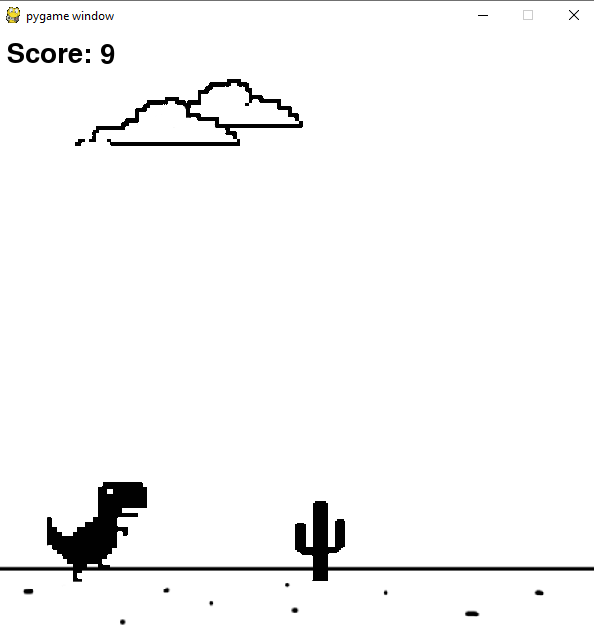

# NEAT-Chrome-Dino
Gra wzorująca się na popularnej przeglądarkowej grze T-Rex Run. Program wykorzystuje ewolucyjne sieci neuronowe zaimplementowanie w bibliotece NEAT do sterowania ruchem gracza.  

## Screenshots

